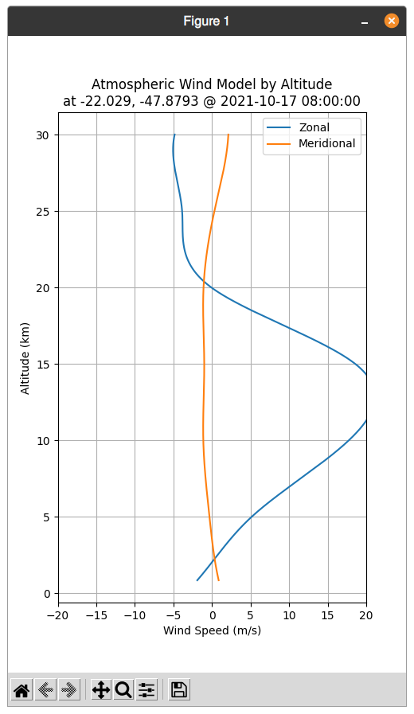

# WindSim
## HWM14 Model Script
Script to run the Horizontal Wind Model 2014

## Installing
This script depends on the [pyHWM14](https://github.com/rilma/pyHWM14) library
that seems to be unmaintained. It can't be installed normally via `pip`, but 
installing from source still works. I've provided a helper script, but you have 
to run it after installing dependencies via `pip`. It is also required (for now) to use 
a virtual environment.
```bash
$ virtualenv -p python3 venv
$ source ./venv/bin/activate
$ pip install -r requirements.txt
$ ./hwm_install.sh
```

## Running
```bash
$ ./wind -h
usage: wind [-h] [--coordinate LAT LON] [--altitudes START END] [--time DATETIME]

Graph Wind speed by altitude at location

optional arguments:
  -h, --help            show this help message and exit
  --coordinate LAT LON  decimal coordinates latitude and longitude
  --altitudes START END
                        range of altitudes in km
  --time DATETIME       ISO format date-time  
```

## Screenshot



